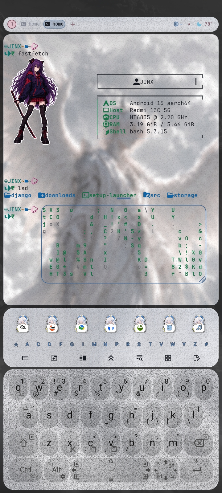

# Fastfetch Dotfiles



## Installation

### Termux

clone the repo btw then

Install the required packages:

```bash
pkg update
pkg install fastfetch chafa libsixel
```

### Ubuntu

Install the required packages:

```bash
sudo apt update
sudo apt install fastfetch chafa libsixel-bin
```

### Install

Compile and run the installer:

```bash
gcc dot.c -o dot
./dot
